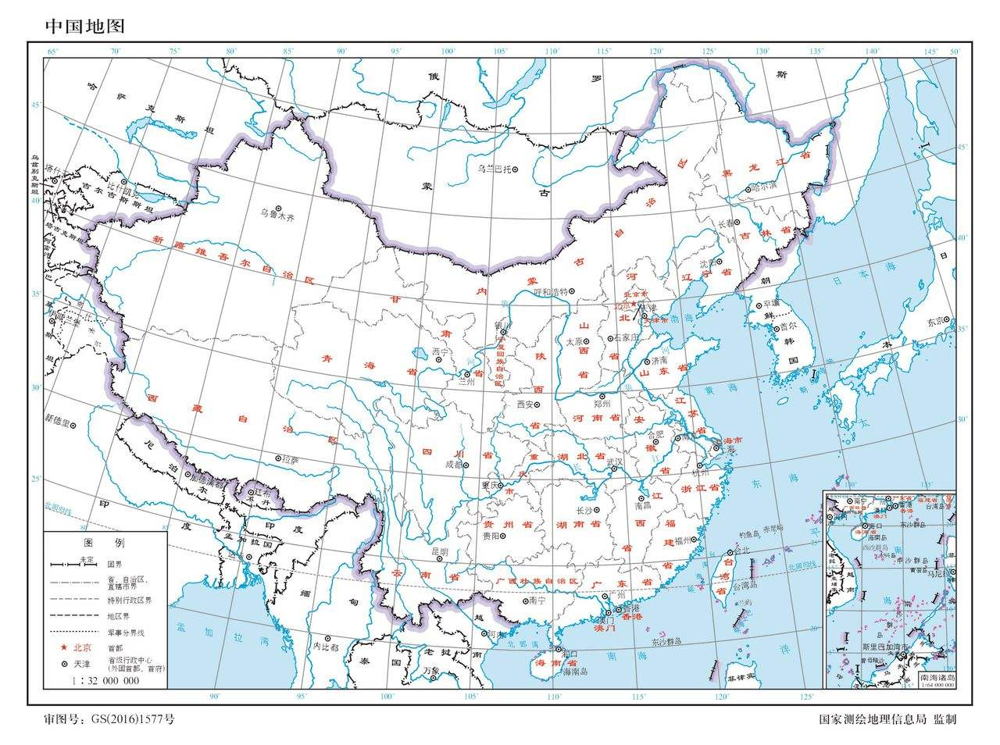

--- 
title: "少数民族都去哪了"
author: "YiSheng Rong"
date: "`r Sys.Date()`"
site: bookdown::bookdown_site
output: bookdown::gitbook
documentclass: book
bibliography: [book.bib, packages.bib]
biblio-style: apalike
link-citations: yes
github-repo: rstudio/bookdown-demo
description: "This is a minimal example of using the bookdown package to write a book. The output format for this example is bookdown::gitbook."

---

# 引子

环地中海文明，往南有非洲埃及文明，往东有中东两河文明，往北有欧洲希腊罗马文明，往西是通往新大陆的大西洋。从苏美尔，到埃及法老，到赫梯亚述，到巴比伦波斯，到希腊罗马，文明一直在这里碰撞融合，继承发展，这是一个开放的区域。

而中国文明地处东亚，地形相对比较封闭，往东是东海，往南是南海，往西是青藏高原，往北是茫茫大漠，在航海技术发达之前，只留下一条丝绸之路跟西方文明若即若离地牵连着。孕育于黄河中下游的华夏文明，成为了中华文明的主导，在这个相对封闭的环境里打造着一个又一个强大的中原王朝。

 

有人说，中国的封建历史就是一个又一个的循环，一个王朝建立，再走向顶峰，再腐败堕落，然后有人揭竿而起，推翻旧王朝，建立另一个新王朝，所以对王朝最大的威胁往往是内忧。当然外患也是一直存在，但仅有几次特别严重的才造成了王朝更迭。这些外患里，虽然偶尔也会有南方的百越三苗南诏，东方渡海而来的倭寇，但是对中原王朝威胁最大的外患，还是来自北方大漠的游牧民族。我们说中原王朝几千年传承，屹立于世界东方，而那些游牧民族已经换了一波又一波。那么曾经在历史上给我们中原王朝带来各种苦难的游牧民族们，现在都去哪里了？

